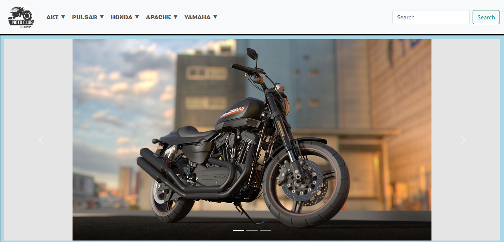
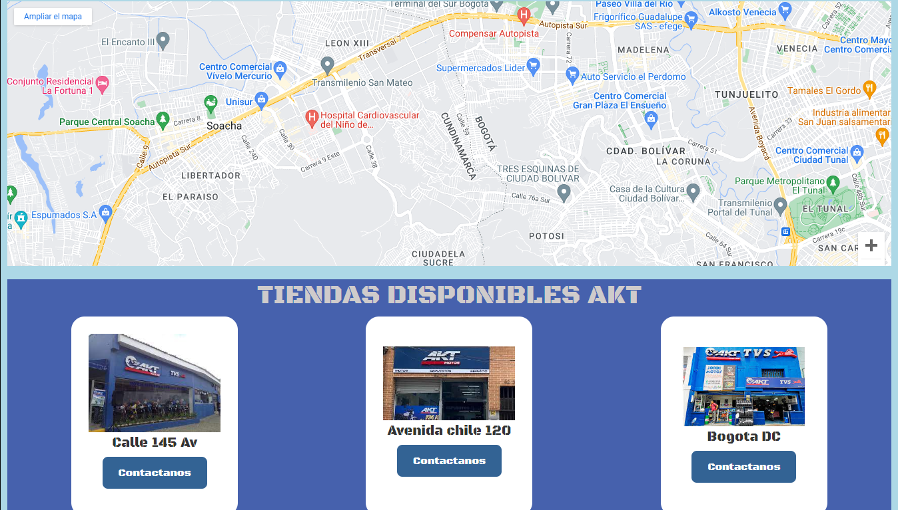
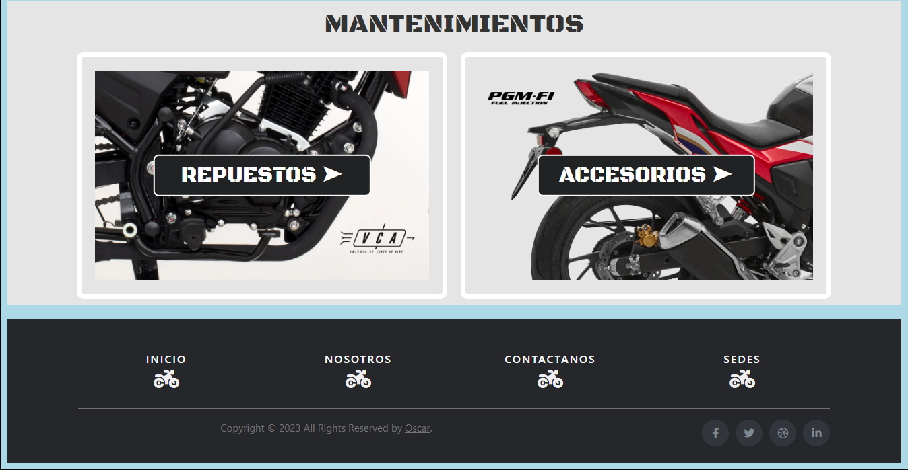

# MotoClub

Este es el repositorio de MotoClub, un sitio web dedicado a los amantes de las motocicletas.

## Descripción

MotoClub es un lugar donde los entusiastas de las motos pueden encontrar información, noticias y recursos relacionados con el mundo de las motocicletas. Nuestro objetivo es reunir a la comunidad motociclista y proporcionar contenido de calidad para todos los aficionados.

## Características

- Información sobre diferentes marcas y modelos de motocicletas.
- Noticias y eventos destacados en el mundo de las motos.
- Recursos útiles para motociclistas, como guías de mantenimiento y consejos de seguridad.
- Galería de imágenes y videos de motocicletas.

## Capturas de pantalla

## Tecnologías utilizadas

- HTML5
- CSS3
- Bootstrap

## Instalación

1. Clona este repositorio: `git clone https://github.com/tuusuario/motoclub.git`
2. Abre el archivo `index.html` en tu navegador web.

## Contribución

¡Todas las contribuciones son bienvenidas! Si tienes ideas para mejorar este proyecto, siéntete libre de hacer un fork del repositorio y enviar tus propuestas a través de pull requests.

